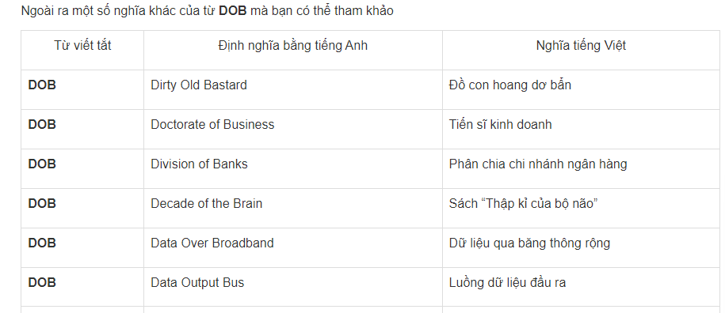

QUY TẮC ĐẶT TÊN RÕ NGHĨA

Trong lập trình ta gần như phải đoặt tên cho tất cả mọi thứ vậy nên làm tốt việc đặt tên là
vấn đề mấu chốt để đạt được Clean Code

- Phong cách đặt tên

camelCase

snake_case

Các quy tắc trong việc đặt tên:

1- Dùng tên thể hiện được mục đích (Intention Revealing Name)
 Tên của biến, hàm, hoặc lớp phải tự trả lời tất cả những câu hỏi về nó.
 Nó phải cho người đọc biết lý do nó tồn tại, nó làm được những gì, và dùng nó ra sao.

2- Tránh dùng những tên dễ gây sai lệch (Avoid Disinformation)
 - Hạn chế dùng - các tên tắt, dễ gây hiểu lầm.

 - Nếu như biến - là 1 tập hợp, không nên gọi là tenBienList trừ khi biến này thực sự là
kiểu List.
 - Không dùng các tên gần gần giống nhau.

3- Tạo sự khác biệt rõ ràng (Make Meaningful Distinctions)
 - Khi phải đặt tên biến liên quan đến từ khóa không đc sử dụng (trùng với các keyword của ngôn ngữ)
. vd: tạo ra một biến tên klass chỉ vì tên class là từ khóa không được phép đặt, và 1 người nào đó nghĩ bạn đã viết sai 
 - chính tả 
=> họ sửa lại thành class => và…..BUG).
 - Không dùng những tên dạng chuỗi số (a1, a2,… aN) khiến cho việc đặt tên thiếu đi mục đích cụ thể.
 - Tránh đặt tên khác nhau nhưng về bản chất mang cùng 1 ý nghĩa.
 - Không sử đụng các yếu tố gây nhiễu không cần thiết trong tên.

4- Dùng những tên có thể phát âm được (dễ dàng thảo luận với team hơn).

5- Đặt tên biến có thể tìm kiếm được
- Người ta có thể dễ dàng tìm kiếm MAX_CLASSES_PER_STUDENT, 
nhưng số 7 thì lại rắc rối hơn. Các công cụ tìm kiếm có thể mở các tệp, các hằng, hoặc các biểu thức chứa số 7 
này, nhưng được sử dụng với các mục đích khác nhau. Thậm chí còn tồi tệ hơn khi hằng số là một số có giá trị 
lớn và ai đó vô tình thay đổi giá trị của nó, từ đó tạo ra một lỗi mà các lập trình viên không tìm ra được => 
các tên dài sẽ dễ tìm kiếm hơn áp dụng nguyên tắc:
- " Độ dài của tên phải tương ứng với phạm vi hoạt động của nó"

6- Không làm rối não người khác :v 
- Khi sử dụng các biến trong vòng for chúng ta thường sử dụng các biến i,j,k vì đây là truyền thống,
nhưng trong hầu hết các trường hợp khác việc đặt tên 1 chữ cái không phải lựa trọn tốt
hãy nhớ rõ nguyên tắc: 
       "Rõ ràng là bố :v"

7- Đặt tên lớp 
- Tên lớp nê sử dụng các danh tù hoặc cụm danh từ, tránh sử dụng các từ như Manager, 
Processer,Data,Infor

8- Tên các phương thức
- Tên các phương thức bắt đầu bằng động từ hoặc cụm động từ như postPayment, deletePage, hoặc save. Các phương thức truy 
cập,
chỉnh sửa thuộc tính phải được đặt tên cùng với get, set và is theo tiêu chuẩn của Javabean.

9- Không dùng từ lóng để đặt tên 

10- Chọn 1 từ cho mỗi khái niệm
- Chọn một từ cho một khái niệm và gắn bó với nó. Ví dụ, rất khó hiểu khi fetch, retrieve và get là các phương thức có
cùng chức năng, nhưng lại đặt tên khác nhau ở các lớp khác nhau.

11- Dùng thuật ngữ 
- Đặt tên theo các thuật ngữ có trong lập trình.

12- Thêm ngữ cảnh thích hợp
- Chỉ có một vài cái tên có nghĩa trong mọi trường hợp – số còn lại thì không. Vậy nên, bạn cần đặt tên phù hợp với ngữ
cảnh, bằng cách đặt chúng vào các lớp, các hàm hoặc các không gian tên (namespace). Khi mọi thứ thất bại, tiền tố nên
- được cân nhắc như là giải pháp cuối cùng.
vd: firstName, lastName, street, houseNumber, city, state và zipcode khi kết hợp với nhau tạo ra 1 địa chỉ 
còn nếu như các biến như firstName hay lastName đứng riêng lẻ thì rất khó suy luận ra ý nghĩa của chúng.
- Bạn có thể thêm ngữ cảnh bằng cách sử dụng tiền tố: addrFirstName, addrLastName, addrState,…
- Hoặc có thể cho các biến vào 1 class 

13 -Quy tắc đặt ten trong Java
 https://niithanoi.edu.vn/6-quy-uoc-dat-ten-tieu-chuan-trong-java.html
